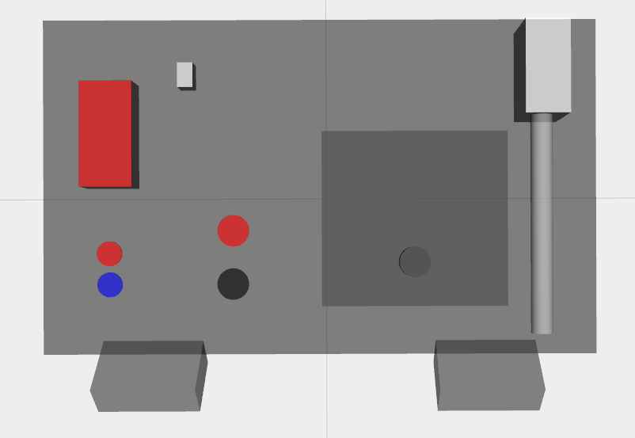

# hrii_task_board_description

This repository contains the description of the Robothon 2023 competition task board
To launch the task board description:

```bash
mon launch hrii_task_board_description task_board.launch
```

TF Tree

Prefix: task_board_
```
base_link
├── box_link
├── blue_button_link
├── red_button_link
├── door_link
│   └── door_handle_link
├── starting_connector_hole_link
├── ending_connector_hole_link
├── left_wire_reel_link
├── right_wire_reel_link
├── m5_display_link
├── starting_slider_link
└── probe_handle_link
     └── probe_link
```

Robothon 2023 Task Board in RViz:

